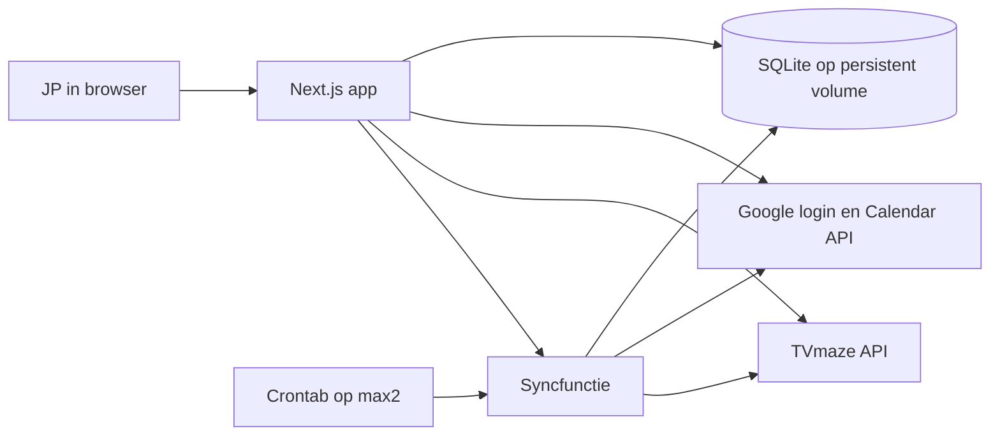

# IDEA-216 — When2Watch: specificatieplan v1

Deze specificatie beschrijft het productgedrag, de technische grenzen, acceptatie en de volgorde van de eerste increments. JP heeft het specificatieplan goedgekeurd op 23 september 2026, met als aanvulling deployment op max2 en de bestaande DNS-entry `when2watch.jp-visser.nl`. Versie 0.2 verwerkt die aanvulling; het is nog geen gematerialiseerd uitvoeringsplan. De max2-afspraak vervangt de NAS-hosting uit de oorspronkelijke grill.

**Product:** [When2Watch](https://thuis.jp-visser.nl/products/cmud1npa000rykh7rlhlhojd3), product-ID `cmud1npa000rykh7rlhlhojd3`. **Idee:** IDEA-216, ID `cmud224u800s0kh7r0s9u7q4y`. **Bron:** grill revisie 1, revisie-ID `cmud2dj2g000bpoqawuavlhlk`, en JP's aansluitende besluiten van 23 september 2026. **Productrepository:** [janpeter/When2Watch](https://git.jp-visser.nl/janpeter/When2Watch).

## 1. Doel en eerste bruikbare resultaat

JP wil een serie toevoegen, automatisch het uitzendschema ophalen en via zijn speciale Google-agenda zien en gemeld krijgen dat er een nieuwe aflevering is.

Het eerste bruikbare resultaat is één echte serie waarvan de afleveringen automatisch in de gekozen agenda komen, met een werkelijk ontvangen herinnering in JP's eigen agenda-app. Dit moet worden aangetoond voordat de volledige interface en uitrol worden afgerond.

De app volgt de oorspronkelijke uitzenddatum uit de bron. Hij doet geen uitspraak over het moment waarop JP de aflevering in Nederland op een bepaalde streamingdienst kan bekijken.

## 2. Scope en besluitstatus

| Onderdeel | Afspraak |
| --- | --- |
| Gebruiker | Eén toegelaten Google-account; e-mail-allowlist, geen gebruikersbeheer |
| Platform | Web-app met Next.js, TypeScript, Prisma en SQLite |
| Hosting | Eén appcontainer met één muterend serverproces op max2, met persistente lokale opslag op max2 |
| Productieadres | `https://when2watch.jp-visser.nl`; DNS-entry bestaat |
| Databron | Alleen TVmaze in v1 |
| Toevoegen | Zoeken met beste matches; JP kiest expliciet de juiste serie |
| Agenda | Bestaande, schrijfbare Google-agenda kiezen; één all-day event per aflevering |
| Synchronisatie | Direct na toevoegen, plus dagelijks via een beveiligde route en de crontab op max2 |
| Interface | Inloggen, overzicht en instellingen; bruikbaar op telefoon en desktop |
| Notificatie | Gewenst: een ochtendmelding op de uitzenddag. Client, tijdstip en uitvoerbare reminderinstelling moeten in de eerste proef worden vastgesteld |

Buiten v1 vallen films, kijkgeschiedenis, IMDb-/Trakt-import, alternatieve databronnen, streamingdienstbeschikbaarheid, multi-user, eigen push/e-mail/Telegram, instelbare reminders per serie en meerdere appreplica's.

**Goedgekeurde v1-scope:** de app gebruikt de reguliere afleveringenlijst van TVmaze, zonder specials. Dat sluit aan op het endpoint uit de grill. Een afwijkende wens voor specials wordt eerst in deze scope verwerkt.

## 3. Gebruikersgedrag

### 3.1 Inloggen en agenda kiezen

JP logt in met Google. Alleen het toegelaten, geverifieerde e-mailadres krijgt toegang; de server controleert dit bij alle gebruikersacties. Een ander account ziet “Dit account heeft geen toegang”.

Google-login en toestemming voor agenda-toegang zijn afzonderlijk herkenbaar: ingelogd zijn betekent niet automatisch dat agenda-toegang is verleend. Instellingen toont alleen agenda's waarop het account events kan beheren. JP kiest de bestemming; de primaire agenda wordt niet stilzwijgend gekozen.

Zolang er geen agenda is gekoppeld, kan JP series zoeken en volgen. Het overzicht toont “Koppel een agenda om afleveringen te synchroniseren”. Zodra een agenda is gekozen, start de eerste agendasynchronisatie.

### 3.2 Zoeken en een serie toevoegen

Na een korte pauze tijdens het typen zoekt de app op de ingevoerde naam. Lege invoer verstuurt geen zoekopdracht. Ook korte titels moeten gezocht kunnen worden; een minimum van drie tekens mag bijvoorbeeld `V` of `ER` niet onvindbaar maken.

De eerste vijf resultaten verschijnen in de relevantievolgorde van TVmaze. “Meer resultaten” toont de overige ontvangen matches. Er komt geen eigen zoekindex en de bron-score wordt niet als zekerheidspercentage gepresenteerd.

Een kandidaat toont titel, startjaar, poster en, waar beschikbaar, land of zender/streamingdienst. Ontbrekende metadata krijgt een neutrale weergave en verhindert toevoegen niet. JP kiest de juiste kandidaat en gebruikt “Toevoegen”. Ook de hoogste match wordt nooit automatisch gevolgd.

Na toevoegen wordt de serie precies eenmaal opgeslagen en worden de afleveringen direct opgehaald. Bij gekoppelde agenda volgt agendasynchronisatie. Mislukt alleen het agenda-deel, dan blijft de gevolgde serie zichtbaar met de fout en “Opnieuw proberen”; de gebruiker hoeft de serie niet opnieuw toe te voegen. Gelijktijdige of herhaalde toevoegverzoeken voor dezelfde serie leveren geen tweede volgrelatie op.

| Situatie | Weergave en gedrag |
| --- | --- |
| Kleine typefout | Beste matches als keuzelijst |
| Gelijknamige series | Jaartal en beschikbare bronmetadata onderscheiden de versies |
| Geen resultaten | “Geen passende serie gevonden. Pas de naam aan of probeer de oorspronkelijke titel.” |
| Kandidaten bevatten de bedoelde serie niet | JP kan de zoektekst aanpassen; geen geforceerde keuze |
| Zoekstoring of limiet | “Zoeken lukt nu niet. Probeer opnieuw.” De zoektekst blijft staan |
| Serie wordt al gevolgd | “Volg je al”; opnieuw toevoegen maakt geen duplicaat |
| Oud antwoord arriveert na een nieuw antwoord | Alleen resultaten voor de huidige zoekopdracht worden getoond |

TVmaze ondersteunt kleine typefouten en sorteert matches op relevantie. Niet iedere vertaling of typefout hoeft gevonden te worden. Gebruik de [zoeklijst van TVmaze](https://www.tvmaze.com/api#show-search), niet het endpoint dat zelf één resultaat kiest. Een serie die werkelijk ontbreekt bij de bron kan v1 niet automatisch volgen.

### 3.3 Overzicht

Het overzicht toont gevolgde series, komende afleveringen op datum, laatste geslaagde synchronisatie en eventuele fout. Een serie zonder aangekondigde datum blijft zichtbaar met “Volgende uitzenddatum nog onbekend”.

De statusweergave volgt de bron: `Running` → “Lopend”, `Ended` → “Gestopt”, `To Be Determined` → “Nog onbekend”. Een onverwachte bronstatus wordt “Onbekend” en veroorzaakt geen opruimactie. “Gestopt” betekent niet specifiek “geannuleerd”. Bronstatus en syncfout zijn afzonderlijke informatie.

Zoekresultaten en knoppen zijn met toetsenbord en schermlezer te gebruiken; laad- en foutstatus zijn tekstueel herkenbaar. Zoekresultaten blijven binnen het overzicht, zonder een extra scherm voor een simpele keuze.

### 3.4 Een serie verwijderen

De actie zegt vooraf: “Serie niet meer volgen en toekomstige When2Watch-afspraken verwijderen”. Na de expliciete verwijderactie wordt de serie niet meer bijgewerkt en worden uitsluitend zijn app-events van vandaag en later opgeruimd. Eerdere afspraken blijven staan.

Bij een storing blijft de lokale informatie voor opruimen bewaard. Het overzicht toont “Opruimen nog niet voltooid” met opnieuw proberen. Een dagelijkse run hervat deze opruimactie. Een verwijderde volgrelatie mag tijdens dat herstel geen nieuwe events genereren.

## 4. Bron- en datumcontract

Series worden geïdentificeerd met het TVmaze-serie-ID, afleveringen met het TVmaze-afleverings-ID. Titel, seizoen en nummer zijn veranderlijke presentatiegegevens en vormen geen identiteit.

De seriegegevens en complete reguliere afleveringenlijst komen uit `/shows/{id}?embed=episodes`. De adapter accepteert alleen een geldig antwoord waarin de verwachte lijst aanwezig is en de records controleerbaar zijn. Een ontbrekende lijst wordt nooit stilzwijgend `[]`.

`airdate` wordt als kalenderdatum bewaard. Een geldige datum bepaalt het agenda-event; een onbekende datum wordt niet ingevuld op basis van aannames. Een ongeldige datum geldt als bronfout, niet als opdracht tot verwijderen. `airstamp` wordt niet gebruikt om de afgesproken datum naar Nederland te verschuiven.

Bij een volledige geldige bronlezing wordt vergeleken met eerder bekende afleveringen. Bij een time-out, HTTP-fout of ongeldig antwoord blijft de bestaande agendatoestand voor die serie behouden. “Verdwenen” betekent hier afwezig in een geslaagde volledige bronlijst; het is geen gevolgtrekking uit een mislukte aanvraag.

De bronadapter verwerkt limietmeldingen met begrensde retries en een zichtbare fout als de bron niet herstelt. Opvragen mag het externe rate limit niet overschrijden. Brondata krijgt een TVmaze-link; gebruik moet voldoen aan de door TVmaze genoemde CC BY-SA-voorwaarden. Zie de [API-documentatie](https://www.tvmaze.com/api).

## 5. Agenda-event en herinnering

Een normaal event heeft:

- Titel: `<Serie> S<NN>E<NN> — <Aflevering>`. Ontbreekt een nummer of titel, gebruik een leesbare variant zonder verzonnen nummer of letterlijk `null`.
- Een startdatum gelijk aan `airdate` en een exclusieve einddatum op de volgende kalenderdag.
- Een beschrijving met TVmaze-bronlink en de uitleg “Oorspronkelijke uitzenddatum; beschikbaarheid kan per land of dienst verschillen”.
- Een privé-eigendomsmarkering met app, interne gebruiker, serie-ID en afleverings-ID.
- De reminderinstelling die in de eerste praktijkproef is vastgesteld.
- Geen genodigden; het event blokkeert geen beschikbaarheid voor afspraken.

Nieuwe en gewijzigde bronafleveringen worden verwerkt vanaf zeven dagen geleden, gerekend in `Europe/Amsterdam`, zonder bovengrens voor bekende toekomstige datums. Historische afleveringen buiten dat venster worden niet nieuw in de agenda geplaatst.

Het all-day model blijft de gewenste vorm. De [Calendar API](https://developers.google.com/workspace/calendar/api/v3/reference/events) beschrijft reminders echter als niet-negatieve minuten vóór de start. De gewenste ochtendmelding wordt daarom niet alvast vertaald naar een verzonnen of ongedocumenteerde parameterwaarde.

Voor acceptatie zijn het opgeslagen event, de teruggelezen reminder en de ontvangen melding op JP's gekozen apparaat nodig. Bij onhaalbaarheid kiest JP tussen all-day met een bewezen agenda-/clientinstelling of een kort event op een vaste ochtendtijd. Dat is een expliciete aanpassing van het contract; een eigen notificatiedienst wordt niet vanzelf toegevoegd.

## 6. Betrouwbare synchronisatie

Alle triggers gebruiken dezelfde syncfunctie en dezelfde uitsluiting van gelijktijdige mutaties voor een gebruiker. Ook toevoegen, verwijderen en agendawisselen respecteren die uitsluiting. Eén muterend serverproces maakt een gedeelde lokale uitsluiting mogelijk, zonder gedistribueerd locksysteem. De uiteindelijke procesopzet en een overlaptest moeten aantonen dat de uitsluiting ook werkelijk alle routes dekt.

Een interactieve toevoegactie die een lopende sync treft, wacht tot de uitsluiting vrijkomt en voert daarna de benodigde synchronisatie uit. De interface toont tijdens het wachten “Synchronisatie bezig”. Bij een afgebroken aanvraag blijft de serie met een zichtbare nog te synchroniseren toestand bewaard en kan JP opnieuw proberen. De app meldt geen succes wanneer alleen de volgende dagelijkse run het werk nog zou kunnen doen. Een overlappende cron-aanroep geeft `409` met `status=busy` en start geen tweede mutatieronde.

### 6.1 Beslissingen per aflevering

| Bestaande toestand en bron | Actie |
| --- | --- |
| Bekende datum in venster, nog geen eigen event | Herstelbare creatie |
| Eigen event en ongewijzigde gewenste velden | Geen Calendar-write |
| Zelfde aflevering, andere datum of titel | Bestaand event bijwerken |
| Geldige volledige bron zegt: datum onbekend of aflevering verdwenen | Eigen event binnen het beheerde venster verwijderen |
| Bronfout | Geen agenda-mutaties voor die serie; fout registreren |
| Gewenste datum schuift buiten het venster naar het verleden | Bestaand beheerd event naar die datum corrigeren; geen nieuw historisch event maken |
| Meerdere bestaande actieve events voor dezelfde app/gebruiker/aflevering | Conflict tonen en automatische mutaties voor die aflevering stoppen |

Bij veranderingen telt zowel de oude als de nieuwe datum: een datumverschuiving mag een oud event niet onbereikbaar maken voor de sync. Afhandeling van al begonnen schrijftaken blijft mogelijk, ook wanneer de datum intussen buiten het venster valt.

### 6.2 Herstel na een onderbroken write

De app bewaart vóór een create-aanvraag een geldig, willekeurig gegenereerd Google-event-ID en de bedoelde agendakoppeling in SQLite. Een retry gebruikt hetzelfde ID. De succesvolle Google-write en de lokale bevestiging worden niet verondersteld één transactie te zijn.

Bij onzekere uitkomst of een antwoord dat het ID al bestaat, wordt dat event teruggelezen en op eigenaarschap en aflevering gecontroleerd. Pas daarna wordt de lokale koppeling bevestigd of het bestaande event bijgewerkt. Een ID-conflict met een andere identiteit wordt niet overschreven. Google beschrijft [zelf toegekende event-ID's](https://developers.google.com/workspace/calendar/api/guides/create-events) juist als bescherming tegen dubbel aanmaken bij zo'n onderbreking; de [foutafhandeling](https://developers.google.com/workspace/calendar/api/guides/errors) onderscheidt onder meer een bestaand ID.

Verwijderingen bewaren hun intentie totdat het eigen event aantoonbaar weg is. Een reeds bevestigd verwijderd event telt als afgehandeld. Verloren agenda-toegang wordt niet gelijkgesteld aan succesvolle verwijdering.

Na definitieve verwijdering en later opnieuw volgen mag een nieuwe creatie een nieuw opgeslagen event-ID krijgen. Een onzekere oude create mag nooit om die reden een nieuw ID krijgen. Dit onderscheid voorkomt zowel hergebruik van een verwijderde identiteit als duplicaten na retries.

De vergelijking voor “ongewijzigd” omvat alle door de app beheerde eventvelden, inclusief beschrijving en reminder. Een hash is een optimalisatie, geen bewijs dat een eerdere externe write is geslaagd. Succesvolle lokale toestand wordt pas vastgelegd na een bevestigde externe uitkomst.

### 6.3 Herstel van koppelingen en gedeeltelijke fouten

Ontbreekt een lokale mapping, zoek dan eerst naar bestaande events met de exacte app-/gebruikers-/afleveringsmarkering. Eén match kan worden overgenomen; meerdere matches worden een zichtbaar conflict. Een dergelijke lookup volgt alle responsepagina's. Google ondersteunt hiervoor [private-propertyfilters](https://developers.google.com/workspace/calendar/api/v3/reference/events/list).

Fouten blijven per serie zichtbaar; één mislukte serie blokkeert de overige niet. Voltooide externe writes worden bij een latere fout niet als teruggedraaid voorgesteld. Een volgende run hervat de overgebleven acties.

Handmatige wijzigingen aan When2Watch-events zijn geen tweede invoerbron: de app beheert de beschreven eventvelden. V1 belooft geen directe tweerichtingssynchronisatie; corrigeren of opnieuw volgen gebeurt vanuit When2Watch.

## 7. Van agenda wisselen

Toekomstige app-events gaan mee naar de nieuwe agenda. Eerdere en andere afspraken blijven onaangeroerd.

Een wissel verloopt herstelbaar onder dezelfde uitsluiting als de sync:

1. Controleer de nieuwe agenda en bewaar de wisselintentie, inclusief de oude agenda.
2. Maak of herstel de vereiste toekomstige events op de nieuwe agenda.
3. Ruim per bevestigd nieuw event zijn toekomstige oude app-event op. Oude toekomstige app-events die niet meer gewenst zijn worden eveneens afgehandeld.
4. Markeer de wissel pas voltooid wanneer alle vereiste acties bevestigd zijn.

Bij een fout kan tijdelijk een event op beide agenda's staan. De interface meldt dan dat de wissel nog bezig is; de volgende run hervat exact deze wissel. Zolang die openstaat, gaat nieuwe gewenste agenda-inhoud naar de vastgelegde doelagenda; de oude agenda wordt alleen nog opgeruimd en niet opnieuw aangevuld. De app vergeet de oude agenda niet en beweert geen voltooide verhuizing. Een tweede agendawissel wacht totdat de eerste is opgelost. Ontbreekt toegang tot de oude agenda, dan is dat een zichtbare herstelactie voor JP.

## 8. Login, credentials en dagelijkse uitvoering

Google-login gebruikt een onderhouden OAuth/OIDC-library, met controle van de geverifieerde identiteit en de gebruikelijke bescherming van login- en mutatieverzoeken. Toegang wordt aan de serverkant afgedwongen; queryparameters kiezen niet de gebruiker wiens gegevens worden gewijzigd.

Voor de gekozen agenda-dropdown en het beheren van events zijn de beoogde agenda-scopes `calendar.calendarlist.readonly` en `calendar.events`, naast de scopes voor login. Vraag geen Gmail-mailtoegang of bevoegdheid om agenda's te verwijderen. Verifieer de scopekeuze bij de echte koppeling; zie [Calendar-scopes](https://developers.google.com/workspace/calendar/api/auth).

Tokens en secrets blijven uitsluitend op de server, buiten broncode, browserantwoorden en logs. SQLite en backups vallen onder de toegangsbeperking van de app. Gebruik de bestaande secretvoorziening van de host; dit product introduceert geen nieuw secretsysteem.

Een ingetrokken of definitief onbruikbare toestemming zet `needsReauth` en toont “Koppel Google opnieuw”. Tijdelijke netwerk- of providerfouten vragen een retry, geen nieuwe login. Vernieuwen zonder nieuwe refresh-token in het antwoord mag de bewaarde refresh-token niet wissen.

De persoonlijke OAuth-route en de productie-instelling worden met JP's account getoetst. Production neemt de specifieke Testing-beperking weg, maar is geen garantie tegen [tokenverval](https://developers.google.com/identity/protocols/oauth2#expiration). De uitzondering voor [persoonlijk gebruik](https://developers.google.com/identity/protocols/oauth2/production-readiness/sensitive-scope-verification#personal-use) blijft een operationele randvoorwaarde.

`POST /api/cron/sync` controleert een secret-header uit de serveromgeving, voordat data of agenda's worden benaderd. Een ontbrekende of onjuiste secret geeft `401`. De crontab op max2 roept de route eenmaal per dag aan; er komt geen scheduler in het webproces.

De response bevat runstatus, begin/eindtijd en per serie de aantallen aangemaakt, bijgewerkt, verwijderd, ongewijzigd en mislukt. Een volledig geslaagde run geeft `200`; een gedeeltelijk of geheel mislukte run geeft `502` met dezelfde bruikbare samenvatting. `409` betekent uitsluitend dat een andere run bezig is. De scheduler bewaart het resultaat zonder geheimen te loggen.

Het overzicht toont laatste geslaagde sync én laatste poging/fout. Zo blijft een gemiste dagelijkse run herkenbaar zonder aparte monitoringdienst.

## 9. Kleine technische opzet

De syncfunctie en twee API-adapters draaien binnen de app. De adapters zijn functies/modules met een kleine interface, geen apart framework of services. Zij maken gerichte tests mogelijk.

| Gegevens | Noodzakelijke verantwoordelijkheid |
| --- | --- |
| User | Google-identiteit, e-mail, tokens, gekozen agenda, eventuele agendaovergang en herautorisatiestatus |
| TrackedShow | Unieke relatie gebruiker/serie; bronmetadata; actief of opruimen in behandeling |
| Episode | Afleverings-ID, serie, seizoen/nummer, titel en datum; eerdere toestand voor vergelijking |
| CalendarEventLink | Gebruiker, aflevering, agenda-ID, event-ID, gewenste actie, bevestigde toestand en laatst geslaagde inhoudshash |
| SyncRun | Trigger, tijden, resultaat en fout-/actietellingen per serie |

Een aparte eventkoppeling is nodig omdat dezelfde aflevering tijdens een agendawissel tijdelijk een oude en nieuwe agendakoppeling heeft. Dit vervangt de te beperkte enkele `googleEventId` op Episode; er komt geen externe taakqueue bij.

De appcontainer draait op max2 en gebruikt een persistent SQLite-volume op lokale opslag van max2. Het volume blijft behouden bij een containervervanging. Het concrete opslagpad en de backupvoorziening volgen de gecontroleerde hostinrichting. Databasebestanden worden niet op een verondersteld geschikte netwerkschijf gezet zonder validatie. Vóór persoonlijk dagelijks gebruik wordt herstel van een consistente backup getest. Eventmarkers helpen bij mappings, maar herstellen geen verloren OAuth-toestemming of complete volglijst.

Het productieadres is `https://when2watch.jp-visser.nl`. De DNS-entry is door JP gemeld en een DNS-lookup op 23 september 2026 heeft een A-record bevestigd. Dat bewijst nog geen werkende HTTPS-route naar de app. Bij de eerste praktijkproef worden TLS, reverse-proxyrouting naar de container op max2 en bereikbaarheid vanuit JP's browser gecontroleerd. De bestaande DNS-entry hoeft niet opnieuw te worden aangemaakt.

De Google OAuth-productiecallback gebruikt dezelfde HTTPS-hostnaam. Het exacte callbackpad volgt de gekozen OAuth-library en wordt vóór de proef exact geregistreerd in het Google-project. DNS alleen bewijst niet dat die registratie of callback werkt. Zie de [OAuth-webserverflow](https://developers.google.com/identity/protocols/oauth2/web-server).

## 10. Eerste increment: proef met één serie

**Doel:** aantonen dat de hele route op max2 werkt, bereikbaar via `https://when2watch.jp-visser.nl`. De proef begint met de agenda-koppeling en melding, voordat de volledige interface wordt gebouwd. Een uitsluitend lokale proef geldt niet als bewijs voor de werking op max2.

**Proefgrens:** een afzonderlijke testagenda onder JP's Google-account, dezelfde agenda-app en hetzelfde apparaat als bij werkelijk gebruik. Alleen herkenbare When2Watch-testevents worden aangemaakt of opgeruimd. In deze specificatiefase worden geen credentials ingericht, agenda's gewijzigd of hostinstellingen aangepast.

**Vooraf vast te leggen:** agenda-app/apparaat, gewenste ochtendtijd, enkele echte voorbeeldseries, testagenda, Google-project en het exacte callbackpad onder `https://when2watch.jp-visser.nl`. De host en domeinnaam staan vast; de concrete container-, TLS-, proxy-, opslag- en schedulerinrichting op max2 worden bij voorbereiding gecontroleerd.

De proef levert opeenvolgend op:

1. Google-toestemming, lijst met schrijfbare agenda's en een bewaarde keuze.
2. Eén testevent met teruggelezen datum en reminder; daadwerkelijke ontvangst in JP's client. Een synthetisch testevent bewijst alleen meldinggedrag, geen uitzenddatum.
3. Een via naam/matches gekozen echte serie; bronafleveringen opgehaald en een event met de echte datum zichtbaar.
4. Een herhaalde run zonder Calendar-writes, plus een aantoonbare datumcorrectie en herstel na een onderbroken create.
5. Een containerherstart met behouden gegevens en werkende tokenvernieuwing.
6. Eén run die werkelijk door de crontab op max2 is gestart, met teruggelezen resultaat.

Als de reminders niet voldoen, stopt alleen de afhankelijke reminderkeuze voor een besluit van JP. Bronlezing, zoeken en het specificeren van syncregels kunnen doorgaan. Het product wordt dan niet als bruikbaar met werkende ochtendmeldingen afgetekend.

### Voorgestelde bestanden en interfaces voor dit increment

Dit zijn paden voor de productrepository tijdens latere uitvoering, geen beschrijving van al bestaande code. De lokale documentwerkmap bevat nog geen productimplementatie; bij uitvoering moet eerst de actuele repository en zijn instructies worden gelezen.

| Bestand/onderdeel | Interface of resultaat |
| --- | --- |
| `src/server/tvmaze.ts` | Zoeklijst en volledige, gevalideerde serie-/afleveringssnapshot |
| `src/server/google-calendar.ts` | Agenda's tonen; eigen events lezen, aanmaken, bijwerken en verwijderen |
| `src/server/auth.ts` | Serveridentiteit, allowlist en agenda-toestemming |
| `src/server/sync.ts` | Eén gedeelde syncfunctie met runresultaat en uitsluiting |
| `prisma/schema.prisma` | Genoemde gegevens, uniqueness en herstelbare eventkoppelingen |
| `src/app/api/cron/sync/route.ts` | Beveiligde POST-route met bovenstaande status- en resultaatcontracten |
| `src/app/page.tsx`, `src/app/settings/page.tsx` | Minimale invoer/zichtbaarheid voor serie, agenda en fouten |
| `tests/sync.test.ts` | Echte SQLite-testdatabase, gecontroleerde providerresponses en onderbrekingen |
| `docs/praktijkproef.md` | Geschoonde requests/responses, datums, ontvangen melding en beperkingen |

De bronadapter levert een expliciete uitkomst “volledige snapshot” of “fout”; de synclaag mag een fout niet als lege data interpreteren. De Calendar-adapter accepteert een reeds opgeslagen event-ID voor creatie. De syncuitkomst onderscheidt succes, gedeeltelijk mislukt, mislukt en bezig.

De proef mag klein beginnen, maar zijn succes vereist echt platformbewijs. Een mock van Google toont geen ontvangen melding. Een directe handmatige aanroep bewijst niet dat de crontab op max2 werkt. Controle van tokengebruik ná dag zeven wordt apart vastgelegd; dat bewijs kan niet tijdens één korte sessie ontstaan.

## 11. Acceptatie en verificatie

| Eis | Aantoonbaar resultaat |
| --- | --- |
| AC1 — Zoeken/toevoegen | Typefout levert bruikbare matches; gelijknamige series zijn te onderscheiden; JP kiest; directe bronophaal; geen dubbele volgrelatie |
| AC1b — Zoekfouten | Lege lijst, ontbrekende juiste kandidaat, ontbrekende metadata, korte titel, verouderd antwoord en providerstoring hebben het beschreven gedrag |
| AC2 — Agenda kiezen | Alleen geschikte agenda's; keuze blijft na herstart; ontbrekende toestemming is zichtbaar |
| AC2b — Agenda wisselen | Alleen toekomstige eigen events gaan mee; onderbreking hervat zonder vergeten oude agenda of onterechte voltooiingsmelding |
| AC3 — Event en melding | Juiste bron-datum en titel; één event per aflevering; werkelijk ontvangen melding met gekozen client/tijd. Remindercontract is eerst praktisch opgelost |
| AC4 — Dagelijkse run | Echte aanroep vanuit de crontab op max2; correcte samenvatting; ontbrekende/onjuiste secret geeft 401 zonder side effects |
| AC5 — Herhalen/herstellen | Ongewijzigde run schrijft niets; wijziging behoudt eventidentiteit; onderbreking na externe create geeft geen duplicaat |
| AC5b — Gelijktijdigheid | Cron, toevoegen en verwijderen kunnen niet gelijktijdig tegenstrijdige agenda-mutaties uitvoeren |
| AC5c — Bronkwaliteit | Bronfout of ontbrekende lijst wist niets; onbekende datum en verdwenen aflevering worden alleen vanuit geldige brondata afgehandeld |
| AC6 — Overzicht/verwijderen | Bronstatus en onbekende datum correct; alleen toekomstige eigen events verwijderd; mislukte opruiming blijft herstelbaar |
| AC7 — Toegang | Niet-toegelaten account kan geen gegevens lezen of acties uitvoeren; gebruikersacties vertrouwen serveridentiteit |
| AC8 — Storingen | Laatste poging, succes en fout zichtbaar; ingetrokken toestemming vraagt herkoppelen; tijdelijke fout bewaart tokens en vraagt retry |
| AC9 — Bewaren/herstellen | Herstart behoudt gegevens; consistente backup is teruggezet en getest; geen secrets in bewijsbestanden |
| AC10 — Host en adres | Appcontainer en persistente opslag op max2; app en Google-callback werken via `https://when2watch.jp-visser.nl` met geldige TLS |

Gebruik Vitest met een echte SQLite-testdatabase voor statusovergangen, uniqueness en herstel. Gebruik geschoonde echte TVmaze-responses voor parsergevallen; muteer die gericht om ontbrekende/onjuiste velden te toetsen. Gesimuleerde datumwijzigingen en storingen blijven als simulatie gelabeld. De eerdere zoekproeven zijn bronbewijs, geen test van de nog te bouwen UI.

Het eerste increment hoeft niet alle v1-acceptatie af te ronden. Voor persoonlijk dagelijks gebruik moeten de volledige toepasselijke criteria en de product-DoD zijn behaald.

## 12. Volgorde na deze specificatie

| Increment | Resultaat | Grens |
| --- | --- | --- |
| 1 — Praktijkproef | Eén serie, echte agenda en bewezen melding; basale herhaling/herstel | Geen volledige UI vooraf; afhankelijke reminderkeuze volgt het bewijs |
| 2 — Minimale v1 | Drie schermen, meerdere gevolgde series, fouttoestanden, verwijderen en agendawisselen | Gebruik de bewezen integratie, zonder nieuwe databron of notificatiedienst |
| 3 — Dagelijks gebruik | Crontab, hostconfiguratie en backup/herstel op max2; volledige acceptatie via het vastgelegde domein | Uitrol en eventuele hostwijzigingen binnen de daarvoor geldende autorisatie |

De goedgekeurde specificatie vormt de basis voor het uitvoeringsplan van het eerste increment, met de actuele repository als uitgangspunt. De Scrum4Me-materialisatie volgt pas in die fase: sprint → PBI → stories → taken, met de bestaande hardstop na materialisatie.

## 13. Open keuzes en controle van het document

| Punt | Nodig wanneer | Huidige grens |
| --- | --- | --- |
| JP's apparaat, agenda-app en ochtendtijd | Vóór de reminderproef | Geen aanname over Apple Agenda, Google Agenda of een tijdstip |
| Concrete Google-/max2-configuratie en voorbeeldseries | Bij voorbereiding praktijkproef | max2 en `when2watch.jp-visser.nl` staan vast; credentials, callbackpad en hostinstellingen worden gecontroleerd |
| Werkende all-day reminder of gekozen alternatief | Na eerste praktijkbewijs, vóór afronden afhankelijk ontwerp | Geen automatische wijziging van all-day naar een tijdgebonden event |

De specificatie is gecontroleerd op aansluiting bij de grill, de goedgekeurde zoekuitwerking en de max2-aanvulling, eigendom bij opruimen, herstel na externe writes, datumvensters en de scheiding tussen bronbewijs en runtimebewijs. Alleen het DNS-record is aanvullend gelezen. Google-login, meldingen, synchronisatiecode, TLS-/proxywerking en uitvoering op max2 zijn nog niet beproefd. Goedkeuring van de specificatie is geen runtimebewijs voor die werking.
